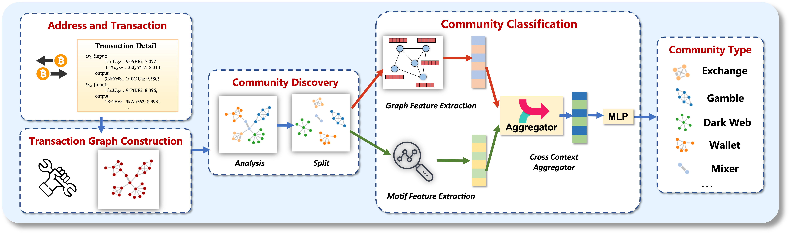

# Enhancing Community Detection in Million-Level Bitcoin Networks via Global and Local Graph Feature Fusion
This repo is the implementation of our ***Bitcoin community classification*** framwork. Within the framework, we present a Bitcoin transaction slicing method to divide transactions into different groups and construct transaction subgraphs for each group. Furthermore, we leverage the Louvain algorithm to screen out communities from the Bitcoin transaction network. Finally, we design an attentive multi-hop graph neural network to extract the global transaction graph features and use the subgraph matching method to capture the local motif features of communities.

## Overview

The high-level pipeline of the proposed framework is illustrated in the Figure, which consists of three major modules, namely Transaction Graph Construction, Community Discovery, and Community Classification.

- **Transaction Graph Construction:** We collect the transaction data from the Bitcoin network and divide the transactions in chronological order. To minimize the information loss during the graph construction, we propose a transaction slicing technique that categorizes transactions into different groups and constructs subgraphs for each group respectively. Moreover, we extend the transaction graph feature by integrating the statistical features of transactions.

- **Community Discovery:** We further employ an unsupervised clustering algorithm to analyze the Bitcoin transaction graph, trying to screen out communities in the Bitcoin network. Specifically, we leverage the Louvain algorithm for community discovery, which partitions the entire Bitcoin transaction graph into multiple distinct communities.

- **Community Classification:** We propose an attentive multi-hop graph neural network to extract global the graph features of Bitcoin transaction graphs and utilize the subgraph matching technique to capture local motif features of communities. Then, we combine the two features to classify different types of Bitcoin communities.

## Required Packages
* **Python** 3.7 or above

* **PyTorch** 1.10.0

* **networkx** 2.1 or above

* **pandas** 1.4.0 or above

* **numpy** 1.21 or above

* **scikit-learn** 0.23 or above

## Dataset
We construct and release a large-scale labeled dataset that contains over 3 million Bitcoin addresses and 10,000 communities. We collect these data from two sources: (1) Addresses and their transactions released by Bitcoin account owners. (2) Addresses and their transactions published by various Bitcoin platforms (e.g., walletexplorer.com, btc.com) and forums (e.g., Bitcoin Talk, Reddit). By analyzing these Bitcoin addresses and transactions, we divide them into eight categories of communities, namely exchange, gambling, mining, wallet, black market, mixer, ransomware, and dark web.

- **Exchange:** This community type consists of exchanges and users who participate in transactions. The addresses involved in the community include hot wallet addresses, cold wallet addresses, deposit and withdrawal addresses, etc.
- **Gambling:** The gambling community contains gambling platforms and users who participate in gambling. Addresses in the community include gambling platform addresses, deposit and withdrawal addresses, etc.
- **Mining:** This community type is composed of mining pools and users participating in mining. The addresses in the community include the coinbase address, income-receiving address, etc.
- **Wallet:** The wallet community is composed of users' wallets.
- **Black Market:** The black market community contains addresses of black market participants, which are used to disburse funds for black market transactions.
- **Mixer:** The mixer community consists of a large number of addresses from different sources, which are often used to hide the flow of Bitcoins.
- **Ransomware:** The ransomware community contains a number of ransomed addresses that pay ransom to extortionists. 
- **Dark Web:** The dark web community contains the addresses of dark web users, which engage in illegal activities, such as anonymous identity verification, fundraising, etc. 

The dataset can be found in [dataset directory](https://github.com/SIGIR2023-Anon/SIGIR2023-Anon/tree/main/transaction_graph_construction/dataset).

